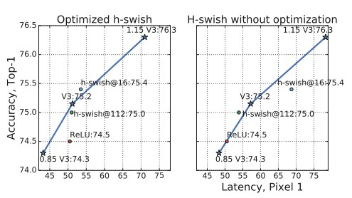

## h-swish
- 仅用于深层次网络（特征图在较浅的层中往往更大，因此计算其激活成本更高，所以采用ReLU）

h-swish速度比ReLU慢，比swish快；精度较ReLU有显著提高

## 深度可分离卷积
- 逐层卷积（depthwise convolution）
- 逐点卷积（1 x 1）（pointwise convolution）
相比常规卷积减少了三分之二的参数量

## 
