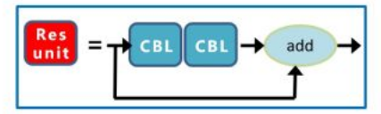
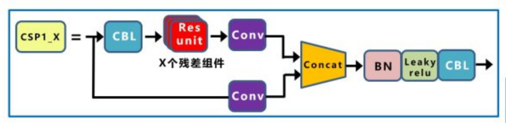
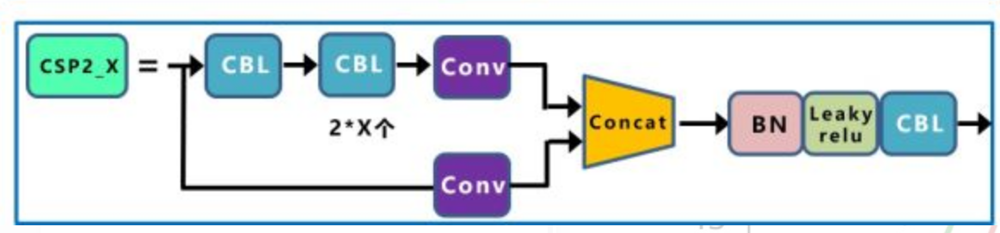
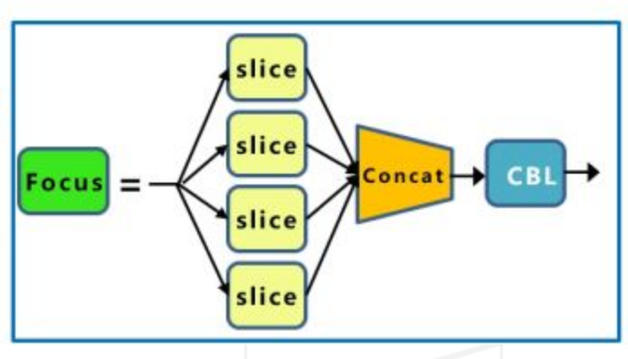
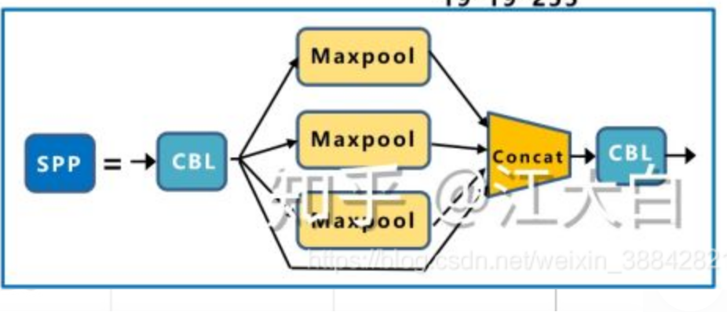
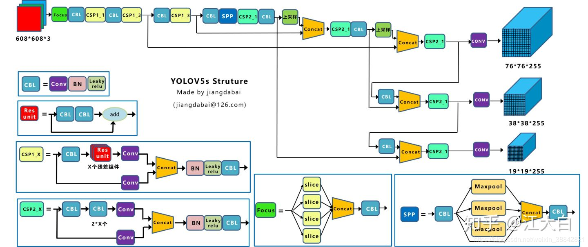

## 为什么使用yolov5
yolov5有很多trick，比如
数据增强方面：

- 马赛克
- 自适应anchors计算
- 图像缩放
- 透视变化
- 混合图片
- 颜色空间变换
性能方面：
- 模型更小，速度更快，适合部署

## yolov5结构特点
- 基础模块CBL: Conv，BN，Leaky ReLU
- 残差模块ResUnit
- 
- csp1
- 
- csp2
- 
- focus
- 
- spp
- 

### CSP结构(跨阶段局部网络)
- CSP1_X结构应用于Backbone主干网络
- CSP2_X结构应用于Neck中
- 增强了CNN的学习能力，能够在轻量化的同时保持准确性。
- 降低计算瓶颈。
- 降低内存成本
- 将梯度的变化从头到尾地集成到特征图中，在减少了计算量的同时可以保证准确率
- 与PRN是一个思想，将feature map拆成两个部分，一部分进行卷积操作，另一部分和上一部分卷积操作的结果进行concat

### focus结构
Focus模块在v5中是图片进入backbone前，对图片进行切片操作，具体操作是在一张图片中每隔一个像素拿到一个值，类似于邻近下采样，这样就拿到了四张图片，四张图片互补，长的差不多，但是没有信息丢失，这样一来，将W、H信息就集中到了通道空间，输入通道扩充了4倍，即拼接起来的图片相对于原先的RGB三通道模式变成了12个通道，最后将得到的新图片再经过卷积操作，最终得到了没有信息丢失情况下的二倍下采样特征图。

- 类似在resnet中的7x7
- 速度更快，且尽可能减少损失信息
- 在TResNet中称为SpaceToDepth（以空间换深度）

### neck部分
采用FPN(feature pyramid networks 特征金字塔) + PAN
- FPN是自顶向下，将高层的强语义特征传递下来，对整个金字塔进行增强，不过只增强了语义信息，对定位信息没有传递。
- PAN在FPN的后面添加一个自底向上的金字塔，对FPN补充，将低层的强定位特征传递上去
