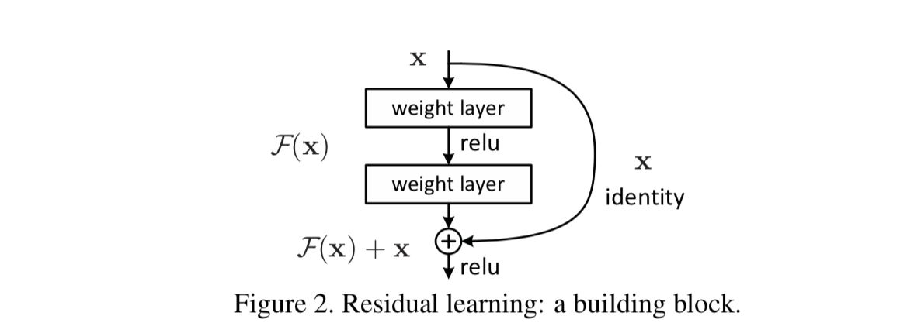

## dropout原理
- 操作：随机选取神经元进行丢弃
- 作用：防止过拟合
- 随机选取神经元进行训练，能使得模型更复杂，减少神经元之间复杂的共适应关系，泛化能力更强
- 缺点：增加了训练时间

## 池化的作用
- 首要作用，下采样（downsamping）
- 降维、去除冗余信息、对特征进行压缩、简化网络复杂度、减小计算量、减小参数量
- 实现非线性
- 可以扩大感知野。
- 可以实现不变性，其中不变形性包括，平移不变性、旋转不变性和尺度不变性。

## 什么是非线性
- 非线性函数只存在于 激活函数 和 pooling
- 卷积是线性的
- 线性就是f(x+y) = f(x) + f(y)
- 假设模型中全是线性部件，则不可能组合复杂函数逼近任意函数

## resnet的结构特点
### 残差块
- 有一个共同的认知是，模型越深越复杂越好，这样可以达到逼近任意函数的目的。但当模型越深时，越容易出现梯度消失或梯度爆炸的情况。残差块解决了这个问题
- 在神经网络可以收敛的前提下，随着网络深度增加，网络的表现先是逐渐增加至饱和，然后迅速下降,称为网络的退化

- 残差单元可以以跳层连接的形式实现，即将单元的输入直接与单元输出加在一起，然后再激活。

