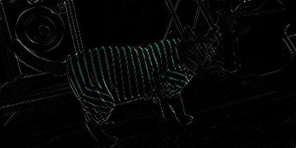

[toc]

## 是否了解一些图像降噪的方法

1. **中值滤波**

   将每一像素点的灰度值设置为该点某邻域窗口内的所有像素点灰度值的中值。原理是把数字图像或数字序列中一点的值用该点的一个邻域中各点值的中值代替，让周围的像素值接近的真实值，从而消除孤立的噪声点。

2. **最大值与最小值滤波**

   最大值滤波，即以模板内进行有序排列后最大像素值代替中心像素值，可以去除图像中的暗斑，使亮斑增大。

   最小值滤波，即以模板内进行有序排列后最小像素值代替中心像素值，可以去除图像中的亮斑，使暗斑增大。

   利用最大值滤波器对胡椒噪声进行处理，成功消除了胡椒噪声，但应注意到，它同时也从黑色物体的边缘移走了一些黑色像素。

   利用最小值滤波器对盐噪声进行处理，在这种情况下，最小值滤波器比最大值滤波器效果更好，但它也从亮物体边缘移走了一些白色像素，使亮物体变小，暗物体变大，这是因为围绕着这些物体的白点被设置成了暗灰度级。

3. **均值滤波**

   均值滤波是典型的线性滤波算法，它是指在图像上对目标像素给一个模板，该模板包括了其周围的临近像素（以目标象素为中心的周围n个像素，构成一个滤波模板，即去掉目标像素本身），再用模板中的全体像素的平均值来代替原来像素值。

   不足之处： 均值滤波本身存在着固有的缺陷，即它不能很好地保护图像细节，在 图像去噪的同时也破坏了图像的细节部分，从而使图像变得模糊，不能很好地去除噪声点。

## 图像增强常用

- 水平翻转、垂直翻转
- 随机crop、five crop
- 基于HSV空间的彩色图像增强
- 亮度
- 角度
- 透视变换
- 灰度化
- 添加噪声
- 填充
- 缩放

## 边缘检测算子

|         卷积作用          |                            卷积核                            |                 卷积后图像                  |
| :-----------------------: | :----------------------------------------------------------: | :-----------------------------------------: |
|         输出原图          | $\begin{bmatrix} 0 & 0 & 0 \\ 0 & 1 & 0 \\ 0 & 0 & 0 \end{bmatrix}$ |                   |
| 边缘检测（突出边缘差异）  | $\begin{bmatrix} 1 & 0 & -1 \\ 0 & 0 & 0 \\ -1 & 0 & 1 \end{bmatrix}$ |      |
|  边缘检测（突出中间值）   | $\begin{bmatrix} -1 & -1 & -1 \\ -1 & 8 & -1 \\ -1 & -1 & -1 \end{bmatrix}$ |    |
|         图像锐化          | $\begin{bmatrix} 0 & -1 & 0 \\ -1 & 5 & -1 \\ 0 & -1 & 0 \end{bmatrix}$ |          |
|         方块模糊          | $\begin{bmatrix} 1 & 1 & 1 \\ 1 & 1 & 1 \\ 1 & 1 & 1 \end{bmatrix} \times \frac{1}{9}$ |             |
|         高斯模糊          | $\begin{bmatrix} 1 & 2 & 1 \\ 2 & 4 & 2 \\ 1 & 2 & 1 \end{bmatrix} \times \frac{1}{16}$ |  |
| 水平sobel算子（检测边缘） | $\begin{bmatrix} 1 & 2 & 1 \\ 0 & 0 & 0 \\ -1 & -2 & -1 \end{bmatrix}$ |                                             |
|       垂直sobel算子       | $\begin{bmatrix} 1 & 0 & -1 \\ 2 & 0 & -2 \\ 1 & 0 & -1 \end{bmatrix}$ |                                             |


## HOG特征原理

HOG即方向梯度直方图（Histogram of Oriented Gradient, HOG），HOG特征通过计算和统计图像局部区域的梯度方向直方图来构成特征。

HOG特征的提取与计算步骤

1. 灰度化（将图像看做一个x,y,z（灰度）的三维图像）；
2. 采用Gamma校正法对输入图像进行颜色空间的标准化（归一化）；目的是调节图像的对比度，降低图像局部的阴影和光照变化所造成的影响，同时可以抑制噪音的干扰；
3. 计算图像每个像素的梯度（包括大小和方向）；主要是为了捕获轮廓信息，同时进一步弱化光照的干扰。
4. 将图像划分成小cells（例如6*6像素/cell）；
5. 统计每个cell的梯度直方图（不同梯度的个数），即可形成每个cell的descriptor；
6. 将每几个cell组成一个block（例如3*3个cell/block），一个block内所有cell的特征descriptor串联起来便得到该block的HOG特征descriptor。
7. 将图像image内的所有block的HOG特征descriptor串联起来就可以得到该image（你要检测的目标）的HOG特征descriptor了。这个就是最终的可供分类使用的特征向量了。

## 图像插值算法

插值指的是利用已知数据去预测未知数据，图像插值则是给定一个像素点，根据它周围像素点的信息来对该像素点的值进行预测。

1. 最近邻插值

   最近邻插值就是选取离目标点最近的点的值(黑点，原来就存在的点)作为新的插入点的值

   

2. 线性插值


   线性插值是以距离为权重的一种插值方式。已知数据 (x0, y0) 与 (x1, y1)，要计算 [x0, x1] 区间内某一位置 x 在直线上的y值：

   

把上边的式子整理得：

   

   意思就是用x和x0，x1的距离作为一个权重，用于y0和y1的加权。双线性插值本质上就是在两个方向上做线性插值。

3. 双线性插值

   在数学上，双线性插值是有两个变量的插值函数的线性插值扩展，其核心思想是在两个方向分别进行一次线性插值。

   

   我们想得到未知函数  $f  $在点 $P = (x, y)$的值，假设我们已知函数 $f$ 在  $Q11 = (x1, y1)$、 $Q12 = (x1, y2) $,  $Q21 = (x2, y1)$ 以及  $Q22 = (x2, y2)$四个点的值。最常见的情况，$f$就是一个像素点的像素值。思路是我们可以将求解过程分解为两次插值过程，首先在x轴方向上进行插值，根据点 $Q11,Q21$得到

   

   根据点 $Q12,Q22$得到 

   

   然后在y轴方向上进行插值， 根据点 $R1$和 $R2$得到

   

   整理得

   

4. 双三次插值

   假设源图像A大小为m*n，缩放后的目标图像B的大小为M*N。那么根据上边提到的方法我们可以得到B(X,Y)在A上的对应坐标为

   $A(x,y)=A(X*(m/M),Y*(n/N))$

   在双线性插值法中，我们选取A(x,y)的最近四个点。而在双三次插值法中，我们选取的是最近的16个像素点作为计算目标图像B(X,Y)处像素值的参数。如图所示：

   

   如图所示P点就是目标图像B在(X,Y)处对应于源图像A中的位置， 假设P的坐标为(i+u,j+v)，其中i,j分别表示整数部分，u,v分别表示小数部分。找到如图所示距离p最近的16个像素的位置，在这里用a(m,n)(m,n=0,1,2,3)来表示。双立方插值的目的就是通过找到一种关系，或者说系数，可以把这16个像素对于P处像素值得影响因子找出来，从而根据这个影响因子来获得目标图像对应点的像素值，达到图像缩放的目的。我在这次的学习中学习的是基于BiCubic基函数的双三次插值法，BiCubic基函数形式如下：
   

   我们要做的就是找到BiCubic函数中的参数x,从而获得上面所说的16个像素所对应的系数。在学习双线性插值法的时候，我们是把图像的行和列分开来理解的，那么在这里，我们也用这种方法描述如何求出a(m,n)对应的系数k_m_n。假设行系数为k_m,列系数为k_n。我们以a00位置为例：首先，我们要求出当前像素与P点的位置，比如a00距离P(i+u,j+v)的距离为(1+u,1+v)。那么a00的横坐标权重k_m_0=W(1+u)，纵坐标权重k_n_0=W(1+v).
   同理我们可以得到所有行和列对应的系数：

   k_m_0=W(1+u), k_m_1=W(u), k_m_2=W(1-u), k_m_3=W(2-u);
   k_n_0=W(1+v), k_n_1=W(v), k_n_2=W(1-v), k_n_3=W(2-v);

   这样我们就分别得到了行和列方向上的系数。

   由横纵坐标权重的乘积可以得到每个像素a(m,n)对应的权值了。比如a00对B(X,Y)的贡献值为：（a00像素值）* k_m_0* k_n_0

   最后通过求和公式可以得到目标图片B(X,Y)对应的像素值：
   

    其中W(m)表示amn横坐标上的权重，W(n)表示amn纵坐标上的权重。三次曲线插值方法相较于前面的最近邻和线性插值而言计算量较大，但插值后的图像效果最好。

## 手写高斯滤波算法

```python
import torch.nn.functional as F
import torch.nn as nn
import torch

class EdgeDetection(nn.Module):
    def __init__(self):
        super(GaussianBlur, self).__init__()
        kernel = [[-1, -1, -1],
                  [-1, 8, -1],
                  [-1, -1, -1]]
        kernel = torch.FloatTensor(kernel).unsqueeze(0).unsqueeze(0)
        self.weight = nn.Parameter(data=kernel, requires_grad=False)

    def forward(self, x):
        x1 = x[:, 0]
        x2 = x[:, 1]
        x3 = x[:, 2]
        x1 = F.conv2d(x1.unsqueeze(1), self.weight, padding=2)
        x2 = F.conv2d(x2.unsqueeze(1), self.weight, padding=2)
        x3 = F.conv2d(x3.unsqueeze(1), self.weight, padding=2)
        x = torch.cat([x1, x2, x3], dim=1)
        return x
```

## 局部连接，权值共享是什么意思

- 局部连接：每个神经元仅与输入神经元的一块区域连接，这块局部区域称作感受野（receptive field）。在图像卷积操作中，即神经元在空间维度（spatial dimension，即上图示例H和W所在的平面）是局部连接。
- 权值共享：计算同一个深度切片的神经元时采用的滤波器是共享的，卷积核的权重系数进行卷积时，在同一张图片上权重值系数是一样的，这就是权值共享。
- 两者的一个关键作用就是**减少参数数量**，使运算变**得简洁、高效**，**能够在超大规模数据集上运算。**

## Pooling 层如何进行反向传播和梯度更新？

对于 max pooling 只对 max value 处进行梯度更新，其它都为 0；对于 average pooling 对之前的 pooling 位置处的所有元素做更新，更新值为 average pooling 层对应位置上的梯度除以采样个数（比如 2x2 pooling 则对应 4）


## maxpooling怎么传达导数

在做maxpooling操作时，记录下最大像素值的下标idx，反向传播将梯度根据idx传递，而其他被舍弃的像素不接受梯度


## Relu在0处可不可导？

$Relu(x)=\left\lbrace\begin{array}{lr}x,&x>0\\0,&x\leq0\end{array}\right.$

$Relu$激活在高等数学上的定义为连续（局部）不可微的函数

其在 $x=0$处是不可微的，但是在深度学习框架的代码中为了解决这个直接将其在 $x=0$处的导数置为1，所以它的导数也就变为了

$\delta_{Relu(x)}=\left \lbrace\begin{array}{lr}1,& x>0\\0,& x\leq0\end{array}\right.$

## 如何选择激活函数

**以下是常见的选择情况：**

1、如果输出是 0、1 值（二分类问题），则输出层选择 ***sigmoid*** 函数，然后其它的所有单元都选择 **ReLU **函数。

2、如果在隐藏层上不确定使用哪个激活函数，那么通常会使用 **ReLU **激活函数。有时，也会使用 ***tanh*** 激活函数，但**ReLU **的一个优点是：当是负值的时候，导数等于 0。

3、**sigmoid **激活函数：除了输出层是一个二分类问题基本不会用它。

4、***tanh*** 激活函数：**tanh **是非常优秀的，几乎适合所有场合。

5、**ReLU **激活函数：最常用的默认函数，如果不确定用哪个激活函数，就使用 ***ReLu*** 或者 ***Leaky ReLU***，再去尝试其他的激活函数。

6、如果遇到了一些死的神经元，我们可以使用**Leaky ReLU**函数。


## BN的实现，BN 算法如何防止过拟合的？BN 算法如何进行网络训练加速的？

BN(Batch Normalization) 归一化

在训练中，BN 的使用使得一个 mini-batch 中的所有样本都被关联在了一起，因此网络不会从某一个训练样本中生成确定的结果。其实这句话的意思是，BN 的使用，使得网络在训练时不依靠于某一个样本进行更新或者输出，而是依赖于整个 batch size 的数据，这样参数不会太依赖于某一个数据，而是一个 batch size 内的数据，一定程度上防止了过拟合。

网络一旦train起来，那么参数就要发生更新，除了输入层的数据外(因为输入层数据，我们已经人为的为每个样本归一化)，后面网络每一层的输入数据分布是一直在发生变化的，因为在训练的时候，前面层训练参数的更新将导致后面层输入数据分布的变化。以网络第二层为例：网络的第二层输入，是由第一层的参数和input计算得到的，而第一层的参数在整个训练过程中一直在变化，因此必然会引起后面每一层输入数据分布的改变。我们把网络中间层在训练过程中，数据分布的改变称之为：“Internal Covariate Shift”。BN的提出，就是要解决在训练过程中，中间层数据分布发生改变的情况。

BN 是通过将每次卷积后的数据分布拉到指定分布域内（比如标准高斯分布），这样在参数学习时，由于数据分布基本相同，学习起来速度会变得很快，特别是对于 sigmoid 类型函数来说，将数据分布拉到非梯度饱和区间，这样避免了梯度消失现象，加快了训练速度。

BN优点：

**（1）BN使得网络中每层输入数据的分布相对稳定，加速模型学习速度**

BN通过规范化与线性变换使得每一层网络的输入数据的均值与方差都在一定范围内，使得后一层网络不必不断去适应底层网络中输入的变化，从而实现了网络中层与层之间的解耦，允许每一层进行独立学习，有利于提高整个神经网络的学习速度。

**（2）BN使得模型对网络中的参数不那么敏感，简化调参过程，使得网络学习更加稳定**

在神经网络中，我们经常会谨慎地采用一些权重初始化方法（例如Xavier）或者合适的学习率来保证网络稳定训练。

**（3）BN允许网络使用饱和性激活函数（例如sigmoid，tanh等），缓解梯度消失问题**

在不使用BN层的时候，由于网络的深度与复杂性，很容易使得底层网络变化累积到上层网络中，导致模型的训练很容易进入到激活函数的梯度饱和区；通过normalize操作可以让激活函数的输入数据落在梯度非饱和区，缓解梯度消失的问题；另外通过自适应学习 ![[公式]](https://www.zhihu.com/equation?tex=%5Cgamma) 与 ![[公式]](https://www.zhihu.com/equation?tex=%5Cbeta) 又让数据保留更多的原始信息。

BN步骤主要分为4步：

1.  求每一个训练批次数据的均值
2.  求每一个训练批次数据的方差
3.  使用求得的均值和方差对该批次的训练数据做归一化，获得0-1分布。其中$ε$是为了避免除数为0时所使用的微小正数。
4.  尺度变换和偏移：将$xi$乘以$γ$调整数值大小，再加上$β$增加偏移后得到$yi$，这里的$γ$是尺度因子，$β$是平移因子。这一步是BN的精髓，由于归一化后的$xi$基本会被限制在正态分布下，使得网络的表达能力下降。为解决该问题，我们引入两个新的参数：$γ$,$β$。 $γ$和$β$是在训练时网络自己学习得到的。

## 对卷积层做BN批量归一化

对卷积层来说，批量归一化发生在卷积计算之后、应用激活函数之前。如果卷积计算输出多个通道，我们需要对这些通道的输出分别做批量归一化，且每个通道都拥有独立的拉伸和偏移参数，并均为标量。设小批量中有$m$个样本。在单个通道上，假设卷积计算输出的高和宽分别为$p$和$q$。我们需要对该通道中$m × p × q$ 个元素同时做批量归一化。对这些元素做标准化计算时，我们使用相同的均值和方差，即该通道中$m × p × q$个元素的均值和方差。


## fpn的结构

FPN（feature pyramid networks）特征图金字塔

我们一般是对同一个尺寸的图片进行网络训练。我们希望我们的网络能够适应更多尺寸的图片，我们传统的做法使用图像金字塔，但是这种做法从侧面提升了计算的复杂度，我们希望可以改善这个问题，所以本文就提出了一种在特征图金字塔的方法，我们称这种网络结构叫做`FPN`


自底向上的路径：自下而上的路径是卷积网络的前馈计算，该算法计算由不同比例的特征映射组成的特征层级，其缩放步长为2。通常有许多层产生相同大小的输出映射，并且我们说这些层 处于相同的网络阶段。 对于我们的特征图金字塔，为每个阶段定义一个金字塔等级， 然后选择每个阶段的最后一层的输出作为我们特征图的参考集。 这种选择是自然的，因为每个阶段的最深层应具有最强的特征。
具体而言，对于ResNets，我们使用每个阶段的最后一个residual block输出的特征激活输出。 对于conv2，conv3，conv4和conv5输出，我们将这些最后residual block的输出表示为${C2，C3，C4，C5}$，并且它们相对于输入图像具有${4, 8, 16, 32} $的步长。 由于其庞大的内存占用，我们不会将conv1纳入金字塔中。

自顶向下的路径：自顶向下的路径通过对在空间上更抽象但语义更强高层特征图进行上采样来幻化高分辨率的特征。随后通过侧向连接从底向上的路径，使得高层特征得到增强。每个横向连接自底向上路径和自顶向下路径的特征图具有相同的尺寸。将低分辨率的特征图做2倍上采样（为了简单起见，使用最近邻上采样）。然后通过按元素相加，将上采样映射与相应的自底而上映射合并。这个过程是迭代的，直到生成最终的分辨率图。
为了开始迭代，我们只需在C5上附加一个1×1卷积层来生成低分辨率图P5。最后，我们在每个合并的图上附加一个3×3卷积来生成最终的特征映射，这是为了减少上采样的混叠效应。这个最终的特征映射集称为${P2，P3，P4，P5}$，分别对应于${C2，C3，C4，C5}$，它们具有相同的尺寸。
由于金字塔的所有层次都像传统的特征化图像金字塔一样使用共享分类器/回归器，因此我们在所有特征图中固定特征维度（通道数，记为d）。我们在本文中设置d = 256，因此所有额外的卷积层都有256个通道的输出。


中间连接：采用1×1的卷积核进行连接（减少特征图数量）。


## CNN反向传播细节，怎么过全连接层，池化层，卷积层

## 梯度消失，梯度爆炸，怎么解决

在反向传播过程中需要对激活函数进行求导，

- 如果**导数大于1**，随着网络层数的增加，梯度更新呈指数级增长，导致梯度爆炸。

- 如果**导数小于1**，随着网络层数的增加，梯度更新呈指数级衰减，导致梯度消失。

解决：

- 非饱和的激活函数（如 ReLU）
- 批量规范化（Batch Normalization）
- 梯度截断（Gradient Clipping）
- 预训练加微调
- 残差结构

## loss为Nan原因

- 梯度爆炸。梯度变得非常大，使得学习过程难以继续。
- 不当的损失函数
- 输入数据错误
- 池化层中步长比卷积核的尺寸大

## relu的缺点

- 由于负数部分恒为0，会导致一些神经元无法激活（可通过设置小学习率部分或leaky relu解决）

- 输出不是以0为中心的

## 计算卷积FLOPs，卷积层参数量

假设：输入feature maps的输入通道数$Cin$（卷积核通道数）、输出的通道数$Cout$（卷积核个数）、卷积核尺寸$kh=kw$（长和宽一样时）分别为：

$Cin,Cout, (k=kh=kw)$

输出的feature maps的大小：$(Hout, Wout)$

基本卷积的参数量: $k^2*Cin*Cout$ （参数量 = 每个卷积核的参数 * 核的数量（输出的通道数））

基本卷积的计算量: $(2*Cin*K^2-1)*Hout*Wout*Cout$

可分离卷积的参数量: $(k^2+Cout)*Cin$

可分离卷积的计算量：$2(k^2+Cout)*Hout*Wout*Cin$ （逐层卷积计算量+逐点卷积计算量）

逐层卷积计算量： $2k^2*1*Hout*Wout*Cin$ (每个特征点所需乘法加法次数*特征点个数)

逐点卷积计算量:  $2*1*1*Cout*Hout*Wout*Cin$ （每个特征点所需乘法加法次数*特征点个数）


## softmax分类器作用，特点，计算公式，损失函数，实现，上溢和下溢

假设有数组$V$，$Vi$是其中一个元素，那么他的softmax值为：

$\huge Si = \huge \frac{e^Vi}{\sum_je^Vj}$

也就是说，是该元素的指数，与所有元素指数和的比值

```python
import math
v = [1.2,2.1,3,0.2,0.7,3.3]

print([math.e**j/sum(math.e**i for i in a) for j in a])

# output
- [0.053619790015071694, 0.13188340234065268, 0.32438082670703305, 0.01972561838647466, 0.032522046611494305, 0.43786831593927367]
```

可以看到，softmax的值域为(0,1)区间，因此可以当做概率来看，有多少类别就设置多少元素$Vi$，最终通过softmax来判断属于哪个类别的概率最高。


## 神经网络权重怎么初始化，为什么要初始化，为0有什么问题

## 如何解决模型不收敛

## 如何加速模型训练

## attention是什么

## normalize的方法有哪些

## 模型评价指标有哪些

## ROC曲线

## 常用的损失函数有哪些

## sigmoid的优缺点

## sigmoid与relu的区别，为什么用relu较多

## l1和l2正则的区别

## sgd

## adam

## 模型蒸馏

## 模型剪枝

## 什么是过拟合，如何解决

## BN为什么防止过拟合

## 样本不均衡如何解决

## 少样本如何训练

